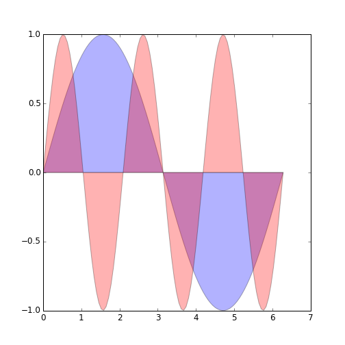
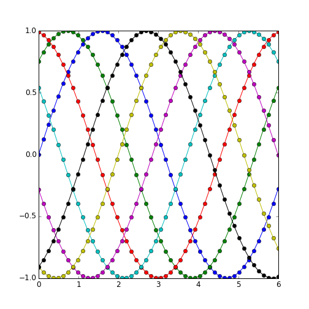

# knitron: knitr + IPython + matplotlib

[](https://travis-ci.org/fhirschmann/knitron)


Knitron brings the power of IPython and matplotlib to [knitr](http://yihui.name/knitr/).

It also brings workspace-like interaction for Python to knitr, so you can define
a variable in one chunk


```python
x = 5
```

and access it in a following chunck


```python
5 + 1
```

```
## 6
```

## Requirements

- R and knitr
- A recent version of IPython (knitron relies on the new `IPython.parallel` API)

## Installation

```r
library(devtools)
install_github("knitron", "fhirschmann")
```

## Usage

```r
library(knitron)
```

That's it! Now you can use IPython in knitr using the `engine = 'ipython'` option
(see the [source code](https://raw.githubusercontent.com/fhirschmann/knitron/master/README.Rmd)
of this page for an example).

By default, the `knitr` IPython profile will be used. You can change this using the `knitron.profile` chunk option. If the profile doesn't exist already, it will be created and can then be modified (take a look at `~/.ipython/profile_knitr`). When the first chunk for each profile gets evaluated, a cluster with one engine will be spawned by knitron if it isn't already running. You can also spawn your cluster in a parallel process using

    ipcluster start --profile=knitr --n=1

If the cluster has been spawned by knitron, it will be terminated on exit.

### Supported Features and Limitations

Most of the original knitr chunk options are supported, including

- `fig.path`
- `fig.width` and `fig.height`
- `dpi`
- `dev` ('pdf' for LaTeX and 'png' for HTML/markdown)

However, there are limitations to some options:

- fig.show only supports 'hold', i.e. all figures are placed at the end of the code chunk

IPython's magic functions are supported too, of course. But there are
some limitations, i.e. magic functions that insert text into the IPython
shell like `%load` without executing them don't work. Likewise, magics
that are meant for interaction use like `%man` and `%edit` cannot work in
knitr.

## Examples

## IPython


```python
from time import sleep

%time sleep(0.5)
```

```
## CPU times: user 0 ns, sys: 0 ns, total: 0 ns
## Wall time: 501 ms
```


```python
%whos
```

```
## Variable     Type                          Data/Info
## ----------------------------------------------------
## matplotlib   module                        <module 'matplotlib' from<...>matplotlib/__init__.pyc'>
## plt          module                        <module 'matplotlib.pyplo<...>7/matplotlib/pyplot.pyc'>
## sleep        builtin_function_or_method    <built-in function sleep>
## x            int                           5
```

### Matplotlib


```python
import numpy as np
x = np.linspace(0, 2 * np.pi, 100)
y1 = np.sin(x)
y2 = np.sin(3 * x)
plt.fill(x, y1, 'b', x, y2, 'r', alpha=0.3)
```


 


```python
L = 6
x = np.linspace(0, L)
ncolors = len(plt.rcParams['axes.color_cycle'])
shift = np.linspace(0, L, ncolors, endpoint=False)
for s in shift:
    plt.plot(x, np.sin(x + s), 'o-')
```


 

### Sympy


```python
import sympy as sm

x, y, z = sm.symbols("x y z")
sm.solve([x * y - 7, x + y - 6], [x, y])
```

```
## [(-sqrt(2) + 3, sqrt(2) + 3), (sqrt(2) + 3, -sqrt(2) + 3)]
```

Of course, you could also use `sm.latex` and `results = 'asis'` in
TeX documents.
